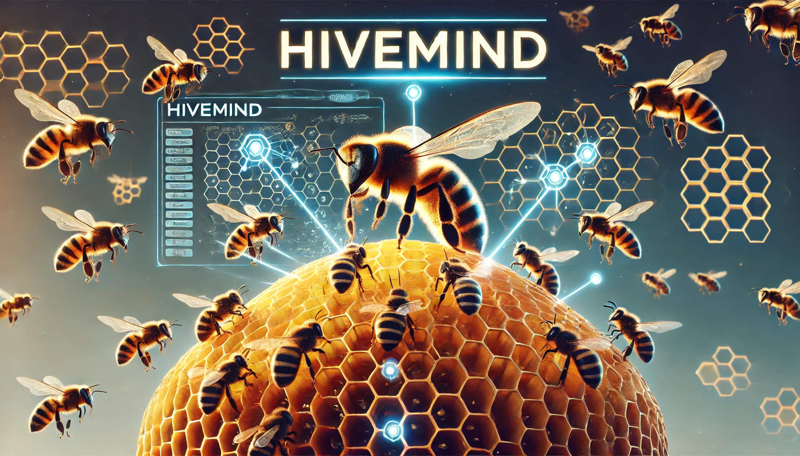

# HiveMind

HiveMind is a framework that orchestrates interactions between multiple specialized agents through a centralized coordinator called the **HiveMindAgent**. The HiveMindAgent interprets user requests, delegates tasks to specialized **SwarmAgents** based on a machine-readable workflow specification, and integrates their responses to deliver cohesive and efficient outcomes.

## Vision

The vision of HiveMind is to create a flexible and scalable framework for orchestrating complex interactions between AI agents. By utilizing a HiveMindAgent that reads machine-readable workflow specifications (in JSON or YAML), HiveMind aims to simplify the development and management of multi-agent systems. This approach enables dynamic task delegation, conditional logic, seamless communication between SwarmAgents, and interactive user engagement when needed, making it easier to build sophisticated AI applications adaptable to various requirements.

## Key Concepts

### HiveMindAgent

- **Role**: Acts as the central orchestrator that manages workflows, handles user interactions, and delegates tasks to SwarmAgents.
- **Responsibilities**:
  - Interpret user requests and determine the appropriate workflow.
  - Read and parse the workflow specification.
  - Invoke SwarmAgents as per the workflow, providing them with necessary context and objectives.
  - Handle responses from SwarmAgents, including processing any requests for additional user input.
  - Maintain and manage the conversation context.
  - Aggregate responses from SwarmAgents and present the final result to the user.

### SwarmAgents

- **Role**: Specialized agents that perform designated tasks within the workflow.
- **Characteristics**:
  - Designed to handle specific functions or expertise areas.
  - Operate based on the prompts and context provided by the HiveMindAgent.
  - Can request additional user input by signaling the need in their responses to the HiveMindAgent.
  - Do not interact directly with the user unless specified through the workflow.

### Workflow Specification

- **Format**: Defined in JSON or YAML.
- **Contents**:
  - **Agents**: Definitions of all SwarmAgents involved, including their roles and initialization parameters.
  - **Workflow Steps**: Sequential or conditional steps outlining the tasks to be performed.
  - **Conditions**: Logic for branching, looping, or conditional execution of steps.
  - **User Inputs**: Points in the workflow where additional user input is required.

## System Requirements

### Performance

- The system should handle agent interactions efficiently to minimize latency.
- Should manage resources effectively to handle complex workflows.

### Scalability

- The architecture should support scaling to include more SwarmAgents and complex workflows without significant refactoring.

### Reliability

- Must ensure that conversation context is consistently maintained and accurately passed between agents.
- Should handle exceptions and errors gracefully, providing meaningful feedback for decision-making.
- Must ensure that user input is correctly obtained and integrated into the workflow when requested.

### Usability

- The system should provide clear and coherent outputs to the user, abstracting the complexity of SwarmAgent interactions.
- Workflow specifications should be user-friendly, allowing easy modification and creation of workflows.
- Should facilitate easy understanding of how SwarmAgents interact within a workflow without relying on enumerated agent examples.

### Security

- Must ensure that sensitive data within the conversation context is protected.
- Should enforce access controls where appropriate between SwarmAgents.

## Future Extensions

While the initial MVP focuses on the core functionality of orchestrating SwarmAgents through a HiveMindAgent using workflow specifications, future enhancements may include:

- **Advanced Decision-Making**: Incorporating more sophisticated logic within the HiveMindAgent for complex workflows.
- **Parallel Processing**: Enabling the HiveMindAgent to invoke multiple SwarmAgents concurrently when tasks can be parallelized.
- **User Feedback Loop**: Providing mechanisms for users to give feedback on SwarmAgent performance to refine the system.
- **Graphical Workflow Editor**: Developing tools to visually design and edit workflow specifications.
- **Dynamic Workflow Modification**: Allowing workflows to be modified in real-time based on evolving requirements or user inputs.

## Getting Started

_Instructions on how to install and use the HiveMind MVP will be provided in future updates._

## Contributing

Contributions to HiveMind are welcome. Please follow the contribution guidelines (to be provided) for submitting issues and pull requests.

## License

HiveMind is released under the MIT License.

---

_Note: This README outlines the vision and requirements for the first MVP of the HiveMind framework. Implementation details, code examples, and detailed documentation will be developed in subsequent stages._
